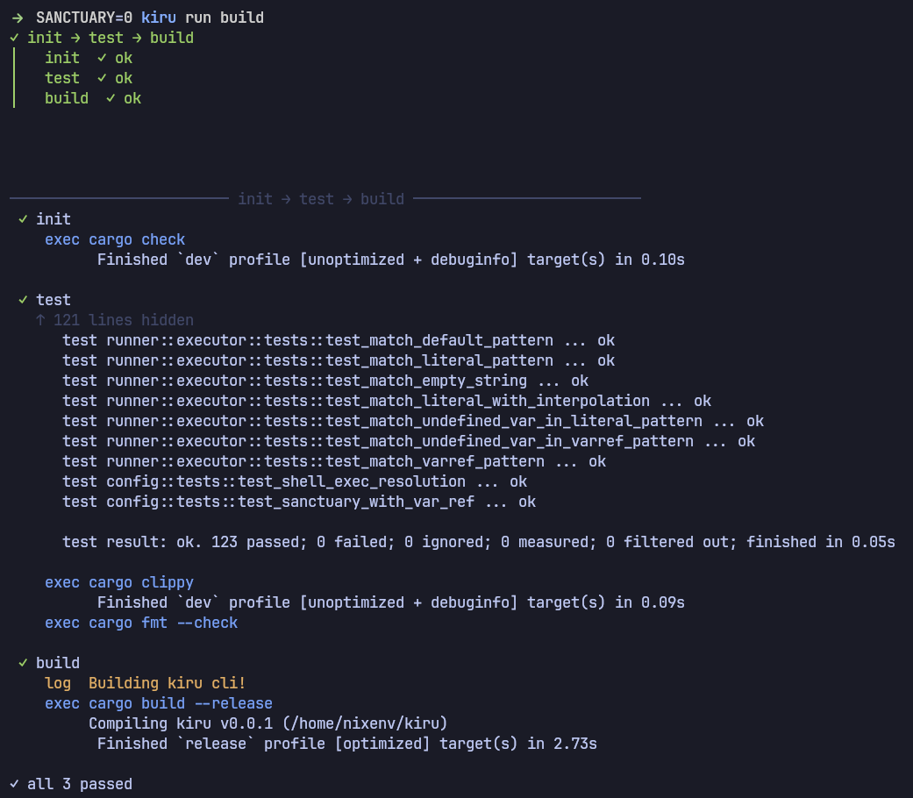

<h1 align="center">kiru</h1>
<p align="center">A statically validated DSL and CLI for multiple git projects orchestration.</p>
<p align="center">
    <a href="LICENSE"></a>
    <a href="https://github.com/infraflakes/kiru/releases"></a>
</p>



---

> [!CAUTION]
> `Kiru` is still in early development, breaking changes might happen!

With **kiru** you declare multiple git repos, write shell functions, and chain them into concurrent pipelines — all in one DSL.

## Why kiru?

Keeping several git repositories in sync usually means a folder of brittle shell scripts or a separate Makefile per project. Scattered, hard to read, and easy to break in ways you only notice once something is already running. **kiru** gives you one small DSL to declare your repos, write the shell commands you already know as functions, and wire them into concurrent or sequential pipelines.

The part we care about most: **kiru statically validates your config**. It catches invalid syntax, undefined variables, and broken function references *before* anything executes so you spot mistakes while editing, not halfway through a deploy.

---

## Quick start

Get the binary via [Releases](https://github.com/infraflakes/kiru/releases) or this quick script:

```bash
curl -sSf https://raw.githubusercontent.com/infraflakes/kiru/main/install.sh | sh
```

Config lives at `~/.config/kiru/main.kiru`. Override with `-c <path>`.

A `.kiru` file reads like the shell you already write:

```kiru
var string app = `todo`;
var shell  os  = `uname -s`;

pr todo [
  url  = `git@github.com:yourname/todo.git`
  dir  = `todo`
  sync = `clone`
] {
    fn build {
        log `Building ${app}`;
        case $os {
            `Linux` { exec `go build -o bin/${app} .`; };
            _        { log `unsupported OS: ${os}`; };
        };
    }

    fn test {
        exec `go test ./...`;
    }

    run ci {
        test => build;
    }
}
```

Run the `ci` pipeline in the `todo` project with:

```bash
kiru run ci todo
```

---

## DSL overview

| construct | what it does |
|---|---|
| **var** | declare a global or project-scoped variable (`string` or `shell`) |
| **import** | split config across multiple `.kiru` files |
| **pr** | declare a git repo with metadata fields — `url`, `dir`, `sync`, `branch` |
| **fn** | a function with execution primitives `log`, `exec`, `cd`, `var`, `env`, `case` |
| **run** | an orchestration block — chains of concurrent and sequential function calls |

---

## Examples

- [Introduction to kiru](./assets/introduction.kiru) — walks through every DSL feature.
- [Example](./assets/example.kiru) — a compact `.kiru` file.
- [EBNF grammar](./assets/kiru.ebnf) — the formal DSL specification.
- We use kiru to build kiru — see our own [.kiru/](./.kiru) config.

---

## Commands

| command | what it does |
|---------|-------------|
| `kiru sync` | clone / update all declared repos |
| `kiru run <name> <project>` | execute a run block that orchestrate functions sequentially or concurrently |
| `kiru fn <name> <project>` | execute one function |
| `kiru status` | parse, resolve, and validate the config |
| `kiru version` | print version |

### Environment

`KIRU_CWD=1` — run `fn` and `run` commands in the current working directory instead of depending on `dir` field in `pr`. Useful for CI/CD pipelines where you're already in the right directory.

---

## Contributing

We would love your help shaping kiru! Whether it's a bug report, a feature idea, or a pull request, every contribution is welcome.

## License

[MIT](./LICENSE)
